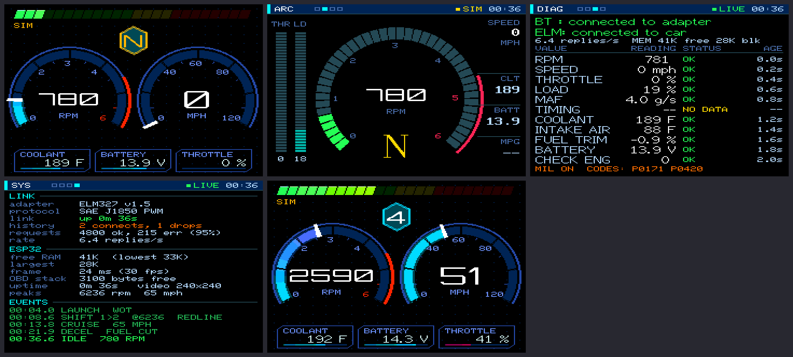

# ESP32 OBD-II composite dashboard

Live engine data from a 2000 Ford Focus, shown on a car head unit's composite
(RCA) video input. An ESP32 reads the car through a Bluetooth ELM327 adapter
(Veepeak VP11, J1850 PWM). The picture goes through a MAX1000 FPGA video card at
720x240 (see `fpga/`); a fallback mode makes the video on the ESP32 itself (GPIO25).



## Sketches

| Folder | What it is |
|---|---|
| `esp32_dash/` | Main dashboard: 4 screens (dual dials, arc tach, diagnostics, system), live OBD data on a background task, LM3914 + RGB shift lights, ignition-style gauge sweep at startup, fake-data simulator for bench testing |
| `esp32_obd_test/` | Single-screen OBD test: every value with its status (OK / NO DATA / TIMEOUT) plus connection debug output |
| `esp32_simple/` | Beginner-friendly two-screen version with `getRPM()`-style getters |
| `esp32_cvbs_test/` | Composite video test pattern |
| `esp32_obd_rpm/` | Minimal Bluetooth ELM327 RPM reader (Serial output) |
| `elm327_client/` | ELMduino's wired multiple-PID example, for reference |
| `uno_dash/`, `uno_tvout_test/` | Black-and-white Arduino Uno version using TVout |
| `dash_preview_app/` | Mac tools: live preview (`./run.sh`) and pre-upload validation (`./validate.sh`) |
| `dash_previews/` | Rendered screenshots |
| `fpga/` | MAX1000 FPGA video card: 720x240, 256 colours, double-buffered composite video in SDRAM (Verilog, simulation, Quartus-in-Docker build). See `fpga/README.md` |
| `esp32_fpga_test/` | ESP32 side of the FPGA card: SPI link test + animated test scene (drawn 360 wide, so it fills the left half of the 720-wide card) |
| `esp32_fake_elm327/` | A fake ELM327 adapter + fake car for a SECOND ESP32: same Bluetooth name, PIN and address as the real Veepeak, answers ELMduino and the dashboard's OBD requests from a simulated drive. Lets the whole Bluetooth/OBD path be tested at a desk |
| `esp32_shift_light_test/` | Shift-light bench test: LM3914 10-LED bar + RGB LED driven by a fake drive cycle, fixed RPMs, or an HW-201 IR sensor as a hand throttle |

## Hardware

- ESP32 with the original ESP32 chip (DACs on GPIO25/26), e.g. ESP32-WROOM-DA. S2/S3/C3 have no DAC.
- Video: MAX1000 FPGA board + 17-resistor DAC (wiring in `fpga/README.md`). ESP32 to MAX1000:
  GPIO18 SCK -> D0, GPIO23 MOSI -> D1, GPIO5 CS -> D2, GPIO19 MISO <- D3, GPIO4 READY <- D4, GND.
- Fallback (`OUTPUT_FPGA false` in `esp32_dash.ino`): GPIO25 to RCA center, GND to RCA shell.
- Button on GPIO27 to GND (or the BOOT button).
- Shift lights: LM3914 SIG (pin 5) <- GPIO26 (DAC), 1 kOhm pin 7 -> pin 8, 1 uF pin 3 -> pin 2,
  LEDs from 5 V (ESP32 VIN) into pins 1 and 18..10; RGB LED on GPIO32/33/13 with one 270 Ohm
  on its common leg.
- Power in the car: a 2-port USB charger, one cable per board.
- Bluetooth Classic ELM327 that supports the car's protocol.

## Libraries

LovyanGFX, ELMduino, ESP32 Arduino core 3.x (BluetoothSerial). Uno version: TVout.

## Memory design

A WROOM ESP32 has ~300 KB of heap; Bluetooth Classic alone costs ~200 KB
(reserved controller RAM + the Bluedroid stack). So `esp32_dash`:

- with the FPGA card, holds no picture at all: frames are drawn in 24-row bands into two
  17 KB DMA buffers and streamed to the FPGA at 40 MHz (~17 fps at 720x240, ~69 KB heap free)
- in the fallback mode, renders at **240x240** without PSRAM (56 KB picture), **360x240** with PSRAM
- draws each frame in 24-row bands through a 5.8 KB strip buffer (`render.h`)
  instead of a full off-screen frame, so nothing flickers and ~80 KB is saved
- keeps guard bytes around the strip buffer and logs `[RENDER] ERROR` if any
  drawing escapes it (LovyanGFX's `drawWedgeLine`/`drawWideLine` ignore the clip
  rect and must not be used; `dash::wedge()` replaces them)
- logs `[MEM]` at each boot step and `[FPS]` every 5 s

## Before uploading

```
cd dash_preview_app
./validate.sh     # every screen at 240/360/720 wide, both render paths: memory escapes + pixel check
./run.sh          # live preview (./run.sh 360 for the PSRAM layout)
./validate_fpga.sh  # same check for the FPGA test scene
```

## Tuning

- RPM feel (dials, shift bar, shift point): `YELLOW_RPM`, `ORANGE_RPM`, `SHIFT_RPM` in `esp32_dash/dash.h`
  (now 2600 / 3200 / 3800). The LED bar starts at `BAR_START_RPM` in `esp32_dash/shift_light.h` (900).
- Startup gauge sweep timing: `UP`, `HOLD`, `DOWN` in `startupSweep()` (`esp32_dash.ino`).

## Single-ESP32 mode and TinySPP

`OUTPUT_FPGA false` runs everything on one ESP32 (video on GPIO25). Two changes made
that mode much better:

- **TinySPP** (`esp32_dash/tiny_spp.h`, on by default, `TINY_BT false` to go back):
  our own minimal Bluetooth Classic serial client written on the radio's HCI interface
  (VHCI). It replaces Arduino's BluetoothSerial, whose Bluedroid stack is built with
  audio, headsets, BLE and 4 connections. It does only what the ELM327 needs: connect
  to one address, legacy PIN pairing, L2CAP, RFCOMM with credit flow control. Measured:
  **+80 KB free RAM** (41 KB -> ~130 KB at 240 wide) and a program half the size
  (1.2 MB -> 634 KB). BluetoothSerial is also deprecated for ESP32 core 4.0.
- **Faster drawing**: the dial value arcs and the ARC tach used hundreds of small arc
  fills, each scanning the whole dial; `fx::gradientRing` and `dash::segmentRing` visit
  each ring pixel once. DUAL went from up to ~300 ms per frame at high RPM to ~40 ms.

Measured on the board (single ESP32, 360x240, TinySPP connected to the fake adapter):
DUAL 31-43 ms, ARC 36-39 ms, DIAG 30 ms, SYS 17 ms per frame; 63 KB heap free.
Direct mode now defaults to 360x240 (`DIRECT_W`) with 120-row bands (`STRIP_ROWS`).

Status: TinySPP is verified against the fake adapter (connect, pair, RFCOMM, OBD
traffic). Not yet tested: the real Veepeak in the car, reconnect after a dropout,
long runs, and FPGA mode with TinySPP on hardware. In single-ESP32 mode the shift
lights are off for now (GPIO26 is the video DAC's twin); the plan is PWM on GPIO22
through a 10 kOhm + 1 uF filter to the LM3914.
