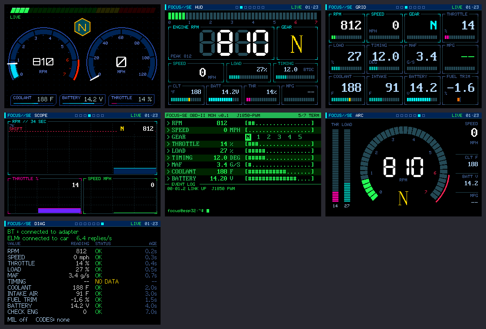

# ESP32 OBD-II composite dashboard

Live engine data from a 2000 Ford Focus, shown on a car head unit's composite
(RCA) video input. An ESP32 reads the car through a Bluetooth ELM327 adapter
(Veepeak VP11, J1850 PWM) and generates the video signal itself on GPIO25.

## Sketches

| Folder | What it is |
|---|---|
| `esp32_dash/` | Main dashboard: 7 screens (dual dials, HUD, grid, scope, terminal, arc, diagnostics), live OBD data on a background task, fake-data simulator for bench testing |
| `esp32_obd_test/` | Single-screen OBD test: every value with its status (OK / NO DATA / TIMEOUT) plus connection debug output |
| `esp32_simple/` | Beginner-friendly two-screen version with `getRPM()`-style getters |
| `esp32_cvbs_test/` | Composite video test pattern |
| `esp32_obd_rpm/` | Minimal Bluetooth ELM327 RPM reader (Serial output) |
| `elm327_client/` | ELMduino's wired multiple-PID example, for reference |
| `uno_dash/`, `uno_tvout_test/` | Black-and-white Arduino Uno version using TVout |
| `dash_preview_app/` | Runs the ESP32 dashboard drawing code on a Mac in an SDL window (`./run.sh`) |
| `dash_previews/` | Rendered screenshots |

## Hardware

- ESP32 with the original ESP32 chip (DAC on GPIO25), e.g. ESP32-WROOM-DA. S2/S3/C3 have no DAC.
- GPIO25 to RCA center, GND to RCA shell. Button on GPIO27 to GND (or the BOOT button).
- Bluetooth Classic ELM327 that supports the car's protocol.

## Libraries

LovyanGFX, ELMduino, ESP32 Arduino core 3.x (BluetoothSerial). Uno version: TVout.

## Known limit

Composite video (86 KB at 360x240) plus Bluetooth Classic (~86 KB) nearly fill a
WROOM ESP32's ~300 KB of RAM, so the flicker-free 86 KB drawing buffer doesn't fit
alongside Bluetooth. `esp32_dash` currently runs a 320x200, no-buffer memory test.
An ESP32-WROVER (with PSRAM) removes the limit.
